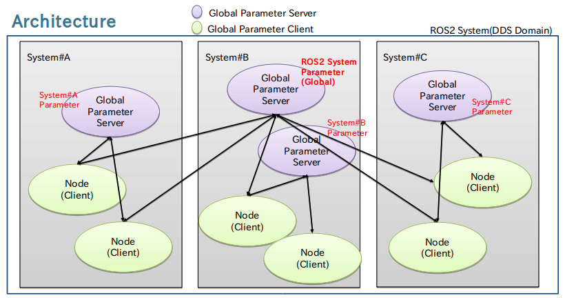

# ROS2 Persistent Parameter Server

This is the PoC project for ROS2 Persistent Parameter Server, that resides in the ROS2 system to serve the parameter daemon. The other nodes can write/read the parameter in Parameter Server, and Parameter Server is able to store the parameter into the persistent storage which user can specify such as tmpfs, nfs, or disk.

# Background

The disussion is opened [here](https://discourse.ros.org/t/ros2-global-parameter-server-status/10114/13), and centralized parameter server is not a good affinity to ROS2 distributed system architecture. One of the most valuable things about ROS APIs is that we make sure that the messages have specific semantic meaning so that they can’t be misinterpreted. As we develop the ROS 2 tools and best practices we should make sure to bring that same level of rigor to parameters too for greater reusability and correctness.

Although, it is expected to be the following requirement.

- Global configuration that many nodes share (e.g. RTOS priorities, vehicle dimensions, …)
- Generic ROS2 system property server.
- Persistent storage support to re-initialize the system. parameters are modified in runtime and cache it into persistent volume as well. and next boot or next re-spawn, modified parameter will be loaded at initialization. (parameter lifetime is dependent on use case, sometimes system lifetime, sometimes node lifetime.)
- Using ROS1 based application with Parameter Server.

# Overview

Generally ROS2 Parameter Server is simple blackboard to write/read parameters on that. The other nodes can write/read the parameter on the server to share them in the ROS2 system. there is a new concept for "Persistent Parameter" which is described later.

ROS2 Parameter Server is constructed on ROS parameter API's, nothing specific API's are provided to connect to the server from the client. Also, about the security it just relies on ROS2 security aspect.

## Configurable Options

- Node Name
  Since ROS2 parameter is owned by node, node name will be needed to access the parameters, this is designed to clearify semantics for the parameters and owners. Node name will be "parameter_server" if node name is not specifies. so the other nodes can use "parameter_server" as well to access in the same system Parameter Server. If there must exist multiple parameter servers, these parameter servers need to specify a different node name, such as "parameter_server_[special_string]", please notice that ROS2 node name can only contains alphanumerics and '_'.
- Persistent Volume
  Definition of "Persistent" is different from user and use cases, so it should be configurable to set the path to store the persistent parameter. Expecting if the parameter's lifespan is system boot, path would be "/tmp" because user wants a fresh start via reboot. Or maybe physical persistent volume is chosen if users want to keep the parameter into the hardware storage. At the initialization time, Parameter Server will load the parameters from the storage which is specified by user.
- Node Options
  there are two important options,
  allow_undeclared_parameters: (default true)
  automatically_declare_parameters_from_overrides: (default true)

all of the configuration options will be passed via arguments as followings.

<table>
    <thead>
        <tr>
            <th>Options</th>
            <th>CLI</th>
            <th>Description</th>
        </tr>
    </thead>
    <tbody>
        <tr>
            <td>Node Name</td>
            <td>__node:=NODENAME</td>
            <td>default parameter_server will be used, generic ROS2 cli parameter to change the node name to specify.</td>
        </tr>
        <tr>
            <td>Help</td>
            <td>--help</td>
            <td>show usage.</td>
        </tr>
        <tr>
            <td>File Path</td>
            <td>--file-path FILE_PATH</td>
            <td>default /tmp/parameter_server.yaml, if specified that path will be used to store/load the parameter yaml file.</td>
        </tr>
        <tr>
            <td rowspan=2>Node Options</td>
            <td>--allow-declare true/false</td>
            <td>default enabled, if specified allow any parameter name to be set on parameter server without declaration by itselt. Otherwise it does not.</td>
        </tr>
        <tr>
            <td>--allow-override true/false</td>
            <td>default enabled, if specified true iterate through the node's parameter overrides or implicitly declare any that have not already been declared.</td>
        </tr>
    </tbody>
</table>

## Sequence

1. parameter server is initialized via __params:=<xxx.yaml>
   this is just a initial parameter to load into the parameter server's memory.
   at this time, these parameters can be seen from the other nodes.
2. parameter server loads parameter specified yaml file if existed via --file-path.
   and then parameter server will overwrite or declare parameters to ROS2 system.
   (*) at #1 parameters might be overwritten.
3.  parameter server starts the main loop with callback for parameter changes.
4.  if the parameter changes are on "/persistent" that will be stored in storage at this time.
5.  at the finilization, flash all of the "/persistent" parameters into the file system.

# Getting Started

[W.I.P]

## Authors

* **Tomoya Fujita** --- Tomoya.Fujita@sony.com

## License

Apache 2.0
